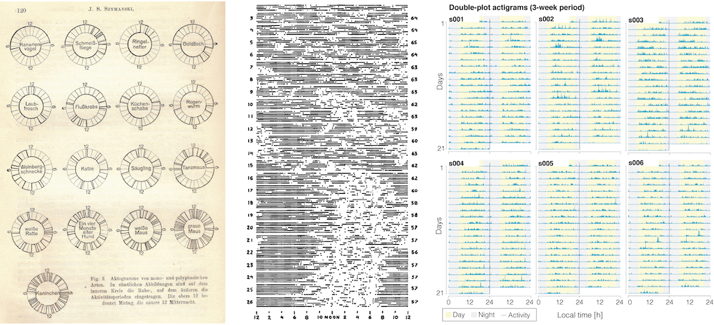

# ADVAnCe - Actigraphy Data Visualization and Analysis Challenge

This repository serves as the main repository for the **Actigraphy Data Visualization and Analysis Challenge** that is part of the PoLNet3 workshop.

## Objective

The goal of the **ADVAnCe - Actigraphy Data Visualization and Analysis Challenge** is to stimulate innovation, creativity and novel thinking in analysing and visualising human rest-activity data.

## Eligibility

The **Actigraphy Data Visualization and Analysis Challenge** is open to anyone. There are no restrictions on country of origin, career status, or any other individual-level characteristics.

## Dataset

The data set to be analysed and visualised is the following data set:

> Angelova, M., Kusmakar, S., Karmakar, C., Zhu, Z., Shelyag, S., Drummond, S., & Ellis, J. (2021). Chronic insomnia and bed partner actigraphy data [Data set]. https://doi.org/10.5061/dryad.b8gtht7bh

The data set contains data from 40 people with chronic insomnia and their 40 bed partners (seven nights). Data were collected with an Respironics Actiwatch Spectrum Pro with 60-second epochs.

## How to submit your entry

To submit an entry, please create a pull request of this repository, containing your submission in a folder called `output` in a PDF, PNG or other standard image format. If you are submitting a reproducible visualisation, please include a folder called `code`, as well as instructions on running the code in a file called `README`.

## Submission deadline

All submissions must be received by 15 November 2021.

## Prize

There will be two prize categories:
* Best visualisation
* Best reproducible visualisation 

There will be a cash prize for each of these.

## Jury

?
